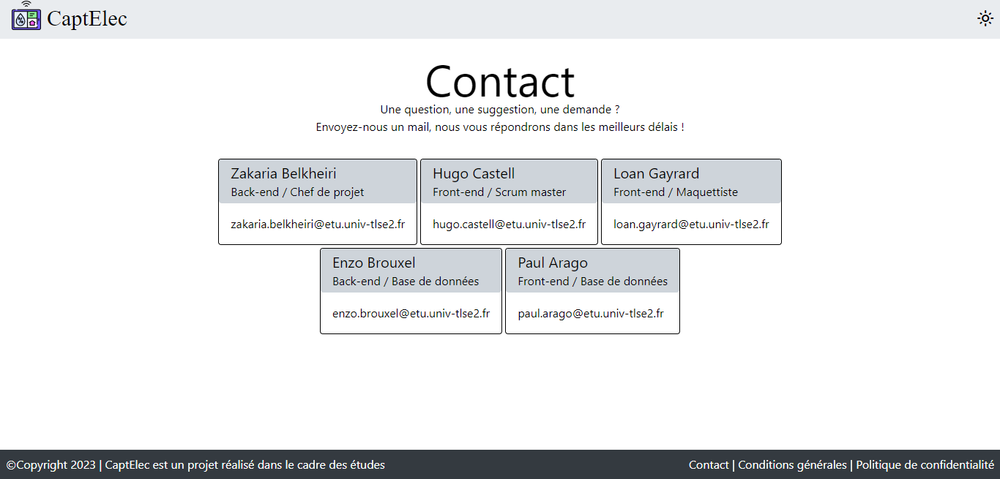

= *DOCUMENTATION Utilisateur*
Hugo CASTELL, Loan GAYRARD, Paul ARAGO, Zakaria BELKHEIRI, Enzo BROUXEL
v1.0 {localdate}
:nofooter:
:toc: left
:toc-title: Sommaire

== Introduction

Ce projet a été réalisé dans le cadre de nos études à l'IUT de Blagnac. L'objectif de ce site web est de tirer parti des multiples capteurs environnementaux placés dans l'IUT. L'utilisateur pourra naviguer sur ce site et observer les différentes données que ces capteurs récupèrent, soit en temps réel soit à un moment précis dans le temps.

== Différentes pages

=== Authentification

Afin d'accéder au site, l'utilisateur doit d'abord s'identifier. Le mot de passe et le nom d'utilisateur sont à définir dans le fichier .env. Pour cela, il faudra indiquer le nom d'utilisateur et le mot de passe à côté de la variable AUTH_LOGINS en respectant le format suivant :
----
AUTH_LOGINS="nom utilisateur:mot de passe"
----
Lorsque l'utilisateur tente de se connecter, si le nom d'utilisateur et le mot de passe entrés sont corrects, l'utilisateur est redirigé vers la page Live.

.Page d'authentification

=== Live

Une fois authentifié, l'utilisateur sera redirigé vers la page "Live". Cette page permet de visualiser en temps réel les données. Il suffit pour cela de cliquer sur les images des bâtiments pour se déplacer au travers des étages. Si l'utilisateur sélectionne par exemple la salle B110, il pourra visualiser les dernières données récupérées par le capteur de la salle B110. Les données accessibles sont la température (en Celsius), le taux de l'humidité (en pourcentage), la batterie du capteur (en pourcentage),le taux de CO2 (en partie par million), le nombre de mouvements dans la salle, la luminosité (en lux) ainsi que la qualité de l'air (tvoc en µg/m³
).

.Etat de la page lorsque l'on arrive
image::img/live_vierge.png[]

Après avoir cliqué sur une salle, le panel des données (ici encadré en rouge) s'affiche en bas de page.

.Panel d'affichage des données
image::img/panel_live.png[]

=== Historique

En haut à gauche de la page "Live", l'utilisateur pourra aussi changer d'onglet, afin de se rendre sur la page "Historique". Cette page lui permet de visualiser les données récupérées par un capteur sur une salle en particulier. Contrairement à la page "Live", qui affiche les données en temps réel, cette page lui permet de visualiser les nouvelles et les anciennes données d'une salle. L'utilisateur pourra choisir une date et une heure afin de visualiser les données à cet instant. Il peut pour cela choisir la date dans un champs en haut de la page, et choisir le moment de la journée grâce au slider. Les données s'afficheront dans un panel en bas de la page, comme la page Live. Ces données sont les données les plus proches et inférieures à la date indiquée.

.Affichage des données du ...
image::img/historique.png[]

=== Contact

La page "Contact" est accessible en bas à droite de chaque page du site. Celle-ci permet à l'utilisateur, s'il rencontre un problème sur le site, de contacter les différents développeurs, afin de les notifier du problème. Il pourra faire des demandes d'améliorations. Les mails et noms des développeurs sont accessibles.

.Page de contact

=== Terms and Conditions et Privacy Policy

Les pages "Terms and Conditions" et "Privacy Policy" permettent respectivement de se renseigner sur les conditions générales du site ainsi que sur la politique de confidentialité. Ces deux pages sont accessibles en bas à droite de chaque page du site.

.Page de conditions générales

.Page de politique de confidentialité
image::img/policy.png[]

== Connexion à Graphana

L'utilisateur peut s'il le veut visualiser les données via le site Graphana.
En cliquant sur https://enzobxl.grafana.net/goto/MR4tHeT4z?orgId=1[ce lien], il pourra visualiser les données des capteurs sous formes de graphiques. Le nom d'utilisateur permettant de se connecter est "captelc.viewer@gmail.com", et le mot de passe est "captelecmdp1". L'utilisateur pourra choisir un bâtiment ainsi qu'une salle. Plusieurs graphiques lui seront alors proposés, par catégories (température, humidité...). Changer de bâtiment affectera les graphiques de gauche, et changer de salle affectera les graphiques de droite. 

.Choix de la salle (encadré en rouge)

.Exemple des graphiques proposés pour la concentration en C02

Il est aussi possible, pour les graphiques de droite, de sélectionner une plage de date en haut à droite de la page. Cliquer sur le bouton encadré en rouge permettra d'ouvrir la fenêtre encadrée en jaune. Celle-ci permettra à l'utilisateur de choisir les dates qui l'intéressent.

.Modification de la plage de date

== Mode nuit

L'utilisateur peut à tout moment changer le thème du site en cliquant sur la petite icône en haut à droite de la page (ici encadrée en rouge). Deux thèmes existent : mode nuit et mode jour.

.Icône de changement de thème

.Illustration du mode nuit

